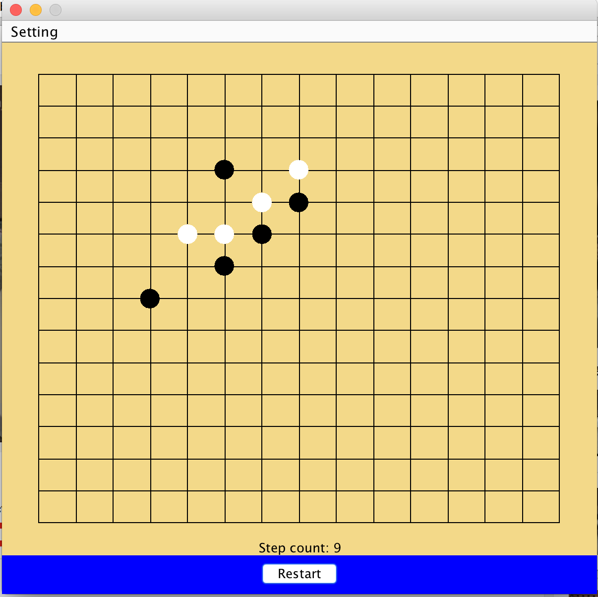

# Connect Five

This is a game, Connect Five, implemented in Java. The game rule is that each players pick a color and take turn to place the chess, the one who
first connect five chess is the winner.

# Set up
 Git clone the repository and run the jar file.
 
# Usage
 * Changing the background color can be done by clicking "setting" and then click on any color from the dropdown menue
 * Placing the chesses by mousing clicking on the target cells.
 

# Technology 
 * Java Swing
 * Java awt
        
        
